# 🧪 GitAlchemy Action

> **A GitHub Action that turns your contribution history into an animated, bubbling wizard's laboratory.**

Your commits fill shelves with bubbling potion flasks, beakers, and ancient spellbooks. Your stars charge the room with floating mana sparks, issues cause unstable magical smoke clouds, and PR merges summon familiars (black cats, owls, or dragons) to keep you company.



---

## 🔮 How It Works

This action queries your public profile metrics and generates custom vector SVG. Using CSS keyframe animations, it animates a floating mana crystal in the center of the room, generates drifting magical sparkles, bubbles potion flasks, flaps dragon wings, and blinks cat eyes.

### The Laboratory Mapping

| GitHub Entity | Laboratory Counterpart |
|---|---|
| 📦 Weekly Commits | Lab assets (Vials, Flasks, Alembics, Spellbooks) |
| ✨ Star Count | Number of floating mana sparkles & crystal speed |
| 🐛 Open Issues | Unstable potion fumes (green/purple smoke clouds) |
| 🐦 Closed Issues / PRs | Summoned familiars (Cats with blinking eyes, Owls, Dragons) |
| 🎨 Top Language | Room elemental magic theme (JS=lightning gold, TS=ether blue, etc.) |
| 🔥 Active Streak | Glow intensity of the central floating mana crystal shard |

---

## 🚀 Setup (2 Steps)

### Step 1: Add the workflow to your profile repository
Create a workflow file in your profile repository (e.g., `Dasmat13/Dasmat13`) at:
`.github/workflows/alchemy.yml`

Paste the following:

```yaml
name: GitAlchemy — Update Profile

on:
  schedule:
    - cron: '0 21 * * *'   # Runs daily
  workflow_dispatch:

jobs:
  alchemy:
    runs-on: ubuntu-latest
    permissions:
      contents: write
    steps:
      - uses: actions/checkout@v4

      - name: Generate GitAlchemy SVG
        uses: Dasmat13/git-alchemy-action@main
        with:
          github_user_name: ${{ github.actor }}
          github_token: ${{ secrets.GITHUB_TOKEN }}
          svg_out_path: dist/alchemy.svg

      - name: Commit & Push SVG
        run: |
          git config user.name  "github-actions[bot]"
          git config user.email "github-actions[bot]@users.noreply.github.com"
          git add dist/alchemy.svg
          git diff --cached --quiet || git commit -m "🧪 Update GitAlchemy [$(date +'%Y-%m-%d')]"
          git push
```

### Step 2: Add to your profile README.md

Add this Markdown image link:

```markdown

```

Trigger the Action manually once, and start brewing spells!

---

## 🛠️ Local Development

```bash
git clone https://github.com/Dasmat13/git-alchemy-action.git
cd git-alchemy-action
npm install
npm run build
```

---

## 📄 License

MIT © [Dasmat13](https://github.com/Dasmat13)
